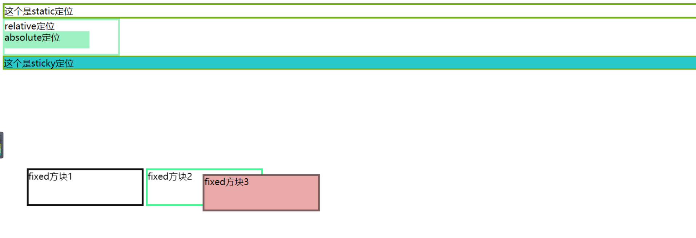

<!-- truncate -->

# css常规布局整理——flex布局实战开发后巩固复盘小结

> 写在前面：
>
> ​	在了解css布局之前，我们先了解两个小概念，我认为这将对你有所帮助！
>
> ​	块级元素：display:bloak；占据一行，下一个元素自动换行，如div等；
>
> ​	行内元素：display:inline；元素没有高宽，根据元素内的内容改变大小，如span、a标签等；
>
> ​	行内块：display:inline-bloak；使行内元素具有块级元素特性、使块级元素具有行内元素特性；

## 1 基础css布局

### **1.1 position定位**

#### 1.1.1 static定位 

#### 1.1.2 fixed定位

#### 1.1.3 static定位

#### 1.1.4 relative定位

#### 1.1.5 sticky定位

以上关于postion定位介绍代码**运行效果如图****1.1**所示：

以上关于postion定位介绍**代码如下**所示：

### 1.2 float定位

## 2 常用的布局有哪些

### 2.1 flex布局 （本章下面将详细讲解）

### 2.2 栅格布局

​	可参考ant design官网的介绍：[https://ant.design/components/grid-cn/](https://ant.design/components/grid-cn/)

### 2.3 网格布局

​	可参考阮一峰的网络日志 - CSS Grid 网格布局教程 ：[http://www.ruanyifeng.com/blog/2019/03/grid-layout-tutorial.html](http://www.ruanyifeng.com/blog/2019/03/grid-layout-tutorial.html)

## 3 flex布局详解

### 3.1 flex布局是什么

### 3.2 总结教程文档

### 3.3 flex布局应用场景

> 参考：
>
> w3school Flexbox 布局模块 https://www.w3school.com.cn/css/css3_flexbox.asp
>
> 一篇文章弄懂flex布局 https://www.cnblogs.com/echolun/p/11299460.html

------

> 注：
>
> ​	如果觉得这些内容有对你有用的话，就请点个赞吧~ 谢谢~ 
>
> ​	个人博客网站：https://zhangqiang.hk.cn
>
> ​	欢迎加入博主的前端学习qq交流群：706947563，专注前端开发，共同学习进步！